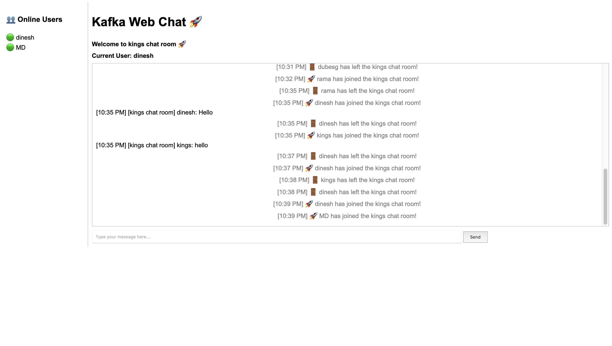

# Sample Screen shot :
Date: April 25 2025:



# Kafka Messenger 🚀

A real-time web-based chat application powered by **Kafka**, **FastAPI**, **WebSocket**, and **Docker**.

This project allows multiple users to chat live using a Kafka topic as the message broker.

---

## 📦 Tech Stack

- FastAPI (WebSocket Server)
- Kafka (Message Broker)
- Docker + Docker Compose (Kafka and Zookeeper setup)
- HTML + JavaScript (Frontend UI)
- Python (Kafka-python, Websockets)
- Uvicorn (ASGI Server)

---

## 🚀 How to Run the Project

### 1. Clone the Repository

```bash
git clone https://github.com/yourusername/kafka-messenger.git
cd kafka-messenger
```

---

### 2. Start Docker Services

Make sure **Docker Desktop** is running.  
Then, in the project folder:

```bash
docker-compose up -d
```

This starts:
- Zookeeper (port 2181)
- Kafka Broker (port 9092)

---

### 3. Create and Activate Virtual Environment

If you don't have one already:

```bash
python3 -m venv venv
source venv/bin/activate  # For Mac/Linux
```

---

### 4. Install Python Dependencies

```bash
pip install -r requirements.txt
```

✅ Make sure `"uvicorn[standard]"` is installed for WebSocket support!

---

### 5. Start the Backend Server

```bash
uvicorn backend.main:app --reload
```

Backend server will start at:  
`http://127.0.0.1:8000`

---

### 6. Open the Frontend

Open `frontend/index.html` manually in your browser:

```bash
open frontend/index.html  # Mac
# OR manually double-click the file
```

You will be asked for a username when the page loads.

✅ Open multiple browser windows or tabs to simulate multiple users.

---

### 7. Start Chatting! 💬

- Type a message and press **Enter** or click **Send**.
- Messages will appear live for all connected users.

---

## ✅ Current Features

- 🚀 Real-time messaging with FastAPI WebSocket server
- 🧵 Backend message brokering with Kafka
- 🐳 Dockerized Kafka and Zookeeper environment
- 🌐 Dynamic chat rooms (user provides room name)
- 👥 Online users list displayed live (sidebar)
- 🟢 Green dot indicators for online users
- 📅 Date separator shown when a new day starts
- 🚪 Broadcast when a user joins or leaves the chat
- 🖼️ Screenshot of the live app included
- 🛠 Environment setup automated with `setup.py`
- 🔄 Automatic Kafka and Docker startup

---

## 📢 Important Notes

- Docker must be running before starting Kafka services.
- Backend server must be running before opening the frontend.
- If WebSocket connection fails, check if `uvicorn[standard]` is installed.

---

## 🛠 Folder Structure

```
kafka-messenger/
├── backend/
│   └── main.py        # FastAPI WebSocket backend
├── frontend/
│   └── index.html     # Frontend chat UI
├── docker-compose.yml # Kafka + Zookeeper setup
├── requirements.txt   # Python dependencies
├── setup.py           # Automatic environment setup
├── README.md          # Project documentation
├── .gitignore         # Git ignore rules
```

---

## 📜 License

This project is for educational and learning purposes.

---